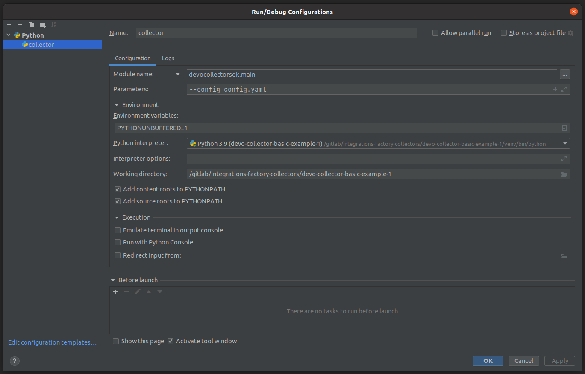

# Intel 471 Malware Intelligence collector for Devo Platform


## Overview

Collects Malware Indicators via Intel 471 TITAN API.

## Vendor Setup

This section will contain all the information required to have an environment ready to be collected, such as:
  * How to create an account
  * How to create the required setup in the environment
  * How to generate some data to be collected
  * How to create credentials (and also the required permissions)

## Minimal Configuration Required

This section will contain all the information required to have the collector instance running, such as:
  * Authentication info
  * List of existing services (remarking mandatory/optional parameters)

## Build and run the collector

### Collector execution during development

Although the final way of executing the data collector is using a Docker container, the data collector can be executed in a local non dockerized environment.

### Using terminal

```
python3 -m devocollectorsdk.main --config <config_filename>.yaml
```

### Using PyCharm

This is a screenshot of a running configuration:



>## **Note**
>
> The required Python package (`devo-collector-sdk==1.6.1`) is not still published in a public repository (the process on going) and, meanwhile this is done, a manual installation has to be done, it can be used the following command:
>
>```script 
>pip install ./devo-collector-sdk-1.6.1.tar.gz
>```

---

### Building

The following bash script must be executed from the collector's root directory.

```bash
./build_tools/build_docker.sh
```

### Running as a Docker container

Change `<version>` with a proper value.
```bash
docker run \
--name collector-cylance-if \
--volume $PWD/certs:/devo-collector/certs \
--volume $PWD/config:/devo-collector/config \
--volume $PWD/credentials:/devo-collector/credentials \
--volume $PWD/state:/devo-collector/state \
--env CONFIG_FILE=config.yaml \
--rm --interactive --tty \
{docker_image_name}:<version>
```

## Vulnerabilities check with Trivy

The security vulnerabilities can be checked using the Trivy software (https://trivy.dev/)

### Local installation

Change `<version>` with a proper value.
```bash
trivy image --severity CRITICAL,HIGH,UNKNOWN path_to_collector_image:<version>
```

### Docker

Change `<version>` with a proper value.
```bash
docker run aquasec/trivy image --severity CRITICAL,HIGH,UNKNOWN devo.com/collectors/ms-graph-collector-if:<version>
```
